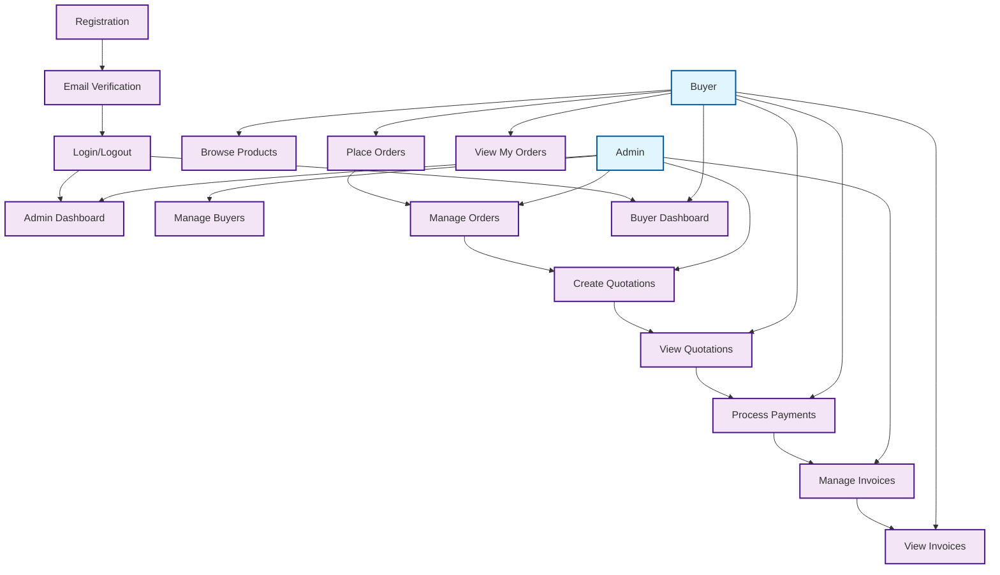

# B2B Textile Platform - Simple Use Case Diagram

## Key Workflows

### **Registration Flow**
Register → EmailVerify → Login

### **Order Flow**
PlaceOrders → ManageOrders → CreateQuotes → ViewQuotes → ProcessPayments → ManageInvoices → ViewInvoices

### **Main Functions**
- **Admin**: Dashboard, Buyer Management, Order Processing, Quotations, Invoices
- **Buyer**: Dashboard, Product Browsing, Order Placement, Payment, Invoice Management
