# B2B Textile Platform - Use Case Diagram

```mermaid
graph TD
    %% Actors
    Admin[Admin User]
    Buyer[Buyer User]
    System[Textile Platform System]

    %% Admin Use Cases
    Admin --> |manages| AdminDashboard[Admin Dashboard]
    Admin --> |approves/rejects| BuyerManagement[Buyer Management]
    Admin --> |views| AllOrders[View All Orders]
    Admin --> |creates| OrderQuotations[Create Quotations]
    Admin --> |manages| OrderStatus[Update Order Status]
    Admin --> |views| AllQuotations[View All Quotations]
    Admin --> |manages| QuotationStatus[Update Quotation Status]
    Admin --> |views| AllInvoices[View All Invoices]
    Admin --> |generates| InvoiceGeneration[Generate Invoices]
    Admin --> |manages| ProductCatalog[Product Catalog Management]
    Admin --> |monitors| SystemReports[System Reports & Analytics]

    %% Buyer Use Cases
    Buyer --> |accesses| BuyerDashboard[Buyer Dashboard]
    Buyer --> |registers| UserRegistration[User Registration]
    Buyer --> |authenticates| UserAuthentication[User Login/Logout]
    Buyer --> |browses| ProductBrowsing[Browse Products]
    Buyer --> |places| OrderPlacement[Place Order]
    Buyer --> |views| MyOrders[View My Orders]
    Buyer --> |reviews| OrderQuotations[Review Quotations]
    Buyer --> |accepts| QuotationAcceptance[Accept/Reject Quotations]
    Buyer --> |processes| PaymentProcessing[Process Payments]
    Buyer --> |views| MyInvoices[View My Invoices]
    Buyer --> |downloads| InvoiceDownload[Download Invoices]
    Buyer --> |manages| ProfileManagement[Profile Management]

    %% System Processes
    System --> |validates| EmailVerification[Email Verification]
    System --> |enforces| ApprovalWorkflow[Admin Approval Workflow]
    System --> |manages| SessionManagement[Session Management]
    System --> |processes| DatabaseOperations[Database Operations]
    System --> |handles| ErrorHandling[Error Handling & Logging]
    System --> |sends| Notifications[Email Notifications]

    %% Relationships between Use Cases
    UserRegistration --> |triggers| EmailVerification
    EmailVerification --> |required for| UserAuthentication
    UserAuthentication --> |enables| BuyerDashboard
    UserAuthentication --> |enables| AdminDashboard
    
    OrderPlacement --> |creates| AllOrders
    AllOrders --> |triggers| OrderQuotations
    OrderQuotations --> |visible to| OrderQuotations
    QuotationAcceptance --> |updates| QuotationStatus
    OrderStatus --> |when CONFIRMED| InvoiceGeneration
    InvoiceGeneration --> |visible in| AllInvoices
    AllInvoices --> |visible to| MyInvoices

    BuyerManagement --> |updates| ApprovalWorkflow
    ApprovalWorkflow --> |enables| UserAuthentication

    %% Extend/Include Relationships
    UserRegistration -.-> |includes| EmailVerification
    OrderPlacement -.-> |requires| ProductBrowsing
    QuotationAcceptance -.-> |requires| OrderQuotations
    PaymentProcessing -.-> |follows| QuotationAcceptance
    InvoiceDownload -.-> |requires| MyInvoices

    %% Styling
    classDef actor fill:#e1f5fe,stroke:#01579b,stroke-width:2px
    classDef usecase fill:#f3e5f5,stroke:#4a148c,stroke-width:2px
    classDef system fill:#e8f5e8,stroke:#2e7d32,stroke-width:2px
    classDef process fill:#fff3e0,stroke:#e65100,stroke-width:2px

    class Admin,Buyer actor
    class AdminDashboard,BuyerDashboard,BuyerManagement,AllOrders,OrderQuotations,OrderStatus,AllQuotations,QuotationStatus,AllInvoices,InvoiceGeneration,ProductCatalog,SystemReports,UserRegistration,UserAuthentication,ProductBrowsing,OrderPlacement,MyOrders,OrderQuotations,QuotationAcceptance,PaymentProcessing,MyInvoices,InvoiceDownload,ProfileManagement usecase
    class EmailVerification,ApprovalWorkflow,SessionManagement,DatabaseOperations,ErrorHandling,Notifications system
    class System process
```

## Use Case Descriptions

### **Admin Use Cases**

1. **Admin Dashboard** - Main admin interface with overview statistics
2. **Buyer Management** - Approve/reject buyer registrations, view buyer details
3. **View All Orders** - See all customer orders with filtering and search
4. **Create Quotations** - Generate price quotations for pending orders
5. **Update Order Status** - Change order status (Pending → Quoted → Confirmed → Processing → Delivered)
6. **View All Quotations** - Monitor all quotation statuses
7. **Update Quotation Status** - Manage quotation lifecycle
8. **View All Invoices** - Access all generated invoices
9. **Generate Invoices** - Create invoices for confirmed orders
10. **Product Catalog Management** - Add/edit/remove products
11. **System Reports & Analytics** - View business insights and reports

### **Buyer Use Cases**

1. **Buyer Dashboard** - Personal dashboard with order summaries
2. **User Registration** - Sign up with company details and GST number
3. **User Login/Logout** - Authenticate and manage sessions
4. **Browse Products** - View available fabric products with details
5. **Place Order** - Submit bulk order requests
6. **View My Orders** - Track personal order history and status
7. **Review Quotations** - Examine price quotes from admin
8. **Accept/Reject Quotations** - Approve or decline quotations
9. **Process Payments** - Handle payment for confirmed orders
10. **View My Invoices** - Access personal invoice records
11. **Download Invoices** - Get PDF copies of invoices
12. **Profile Management** - Update company and contact information

### **System Processes**

1. **Email Verification** - Verify buyer email addresses during registration
2. **Admin Approval Workflow** - Ensure admin approval before buyer access
3. **Session Management** - Handle user authentication sessions
4. **Database Operations** - CRUD operations for all data entities
5. **Error Handling & Logging** - Manage system errors and maintain logs
6. **Email Notifications** - Send notifications for order updates, approvals, etc.

## Key Workflows

### **Registration Workflow**
User Registration → Email Verification → Admin Approval → User Authentication

### **Order Processing Workflow**
Order Placement → Admin Review → Quotation Creation → Buyer Acceptance → Payment Confirmation → Order Processing → Invoice Generation → Delivery

### **Data Flow**
- **Orders**: Buyer creates → Admin processes → Status updates
- **Quotations**: Admin creates → Buyer reviews → Accept/reject
- **Invoices**: System generates → Buyer views/downloads

This use case diagram provides a comprehensive overview of your B2B Textile Platform's functionality and can be directly used with Mermaid AI tools for visualization.
